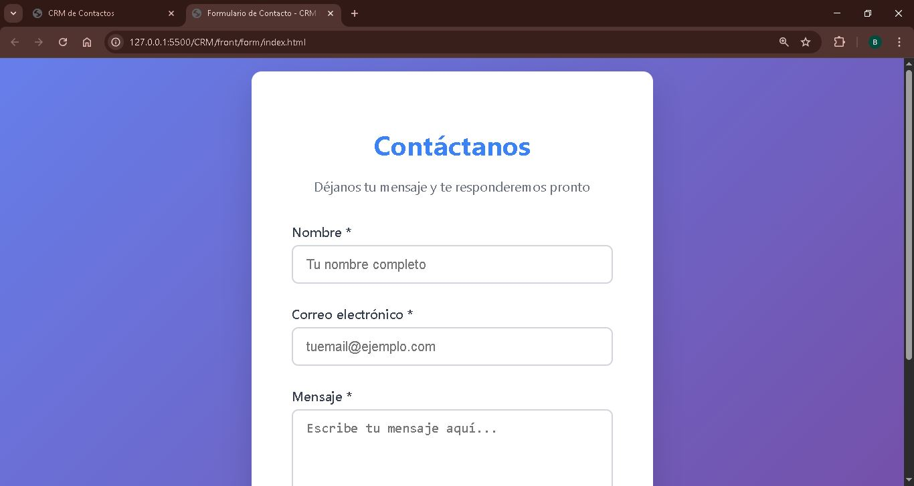
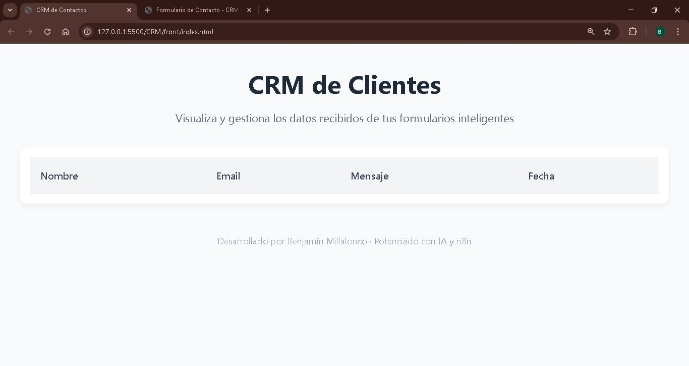

# CRM Dashboard con n8n, Google Sheets y HTML

Este proyecto es un CRM básico que permite registrar usuarios mediante un formulario web y visualizar los datos en un dashboard dinámico conectado a **Google Sheets** usando **n8n**.

## ✨ Características

- Formulario estético en HTML/CSS/JS
- Conexión backend vía `n8n` usando Webhooks
- Almacenamiento automático en Google Sheets
- Dashboard dinámico tipo CRM con tabla de registros
- Preparado para integraciones más avanzadas (IA, notificaciones, filtros)
---

   
## 📷 Capturas

---

---

---

## 🧠 Tecnologías utilizadas

- HTML5 / CSS3 / JavaScript (Vanilla)
- n8n (Automatización sin código)
- Google Sheets (como base de datos)
- Webhooks HTTP (REST)
- Git / GitHub

## 🚀 Cómo funciona

1. Usuario completa el formulario (`index.html`)
2. El formulario envía los datos a un Webhook en n8n (POST)
3. n8n guarda los datos en una hoja de Google Sheets
4. El dashboard (`index.html`) hace una petición GET a otro Webhook
5. n8n responde con los datos almacenados
   
## 🧪 Credenciales y prueba

---
El flujo puede requerir credenciales de Google autorizadas para escribir/leer Sheets. 
Puedes crear una con OAuth2 o usar una clave de servicio.
Prueba tu webhook en n8n antes de integrar.
---
🔐 Notas sobre CORS

---
Este proyecto está diseñado para producción o entornos donde el CORS esté habilitado. Si trabajas en localhost, puedes enfrentar errores de CORS. Recomendaciones:

Subir el frontend a GitHub Pages o Netlify

Usar n8n.cloud para evitar restricciones locales

---
## 📬 Contacto

¿Tienes dudas, sugerencias o estás interesado en trabajar conmigo?

Puedes contactarme a través de:

- ✉️ Email: [benjaminmillalonc@gmail.com](mailto:benjaminmillalonc@gmail.com)
- 💼 LinkedIn: [linkedin.com/in/benjaminmillalonco](https://www.linkedin.com/in/benjaminmillalonco)
- 🖥️ GitHub: [github.com/TU_USUARIO](https://github.com/TU_USUARIO)

Estoy disponible para proyectos freelance, colaboraciones o puestos remotos relacionados con desarrollo web, automatización y herramientas sin código.
